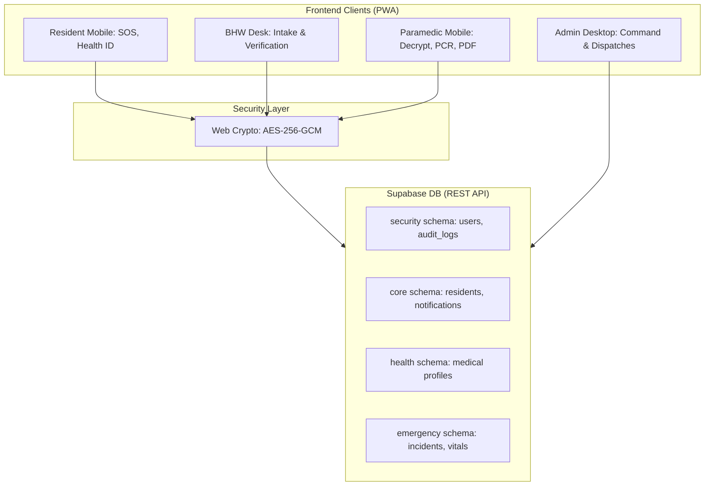
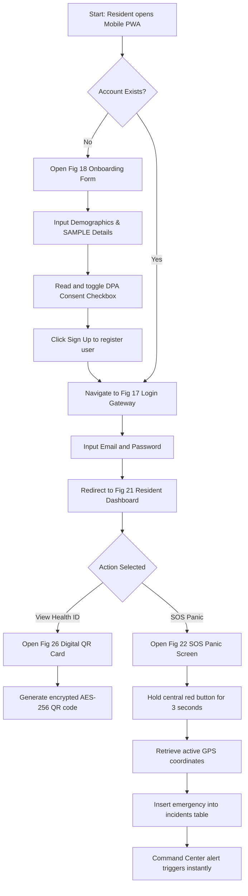
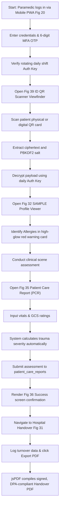
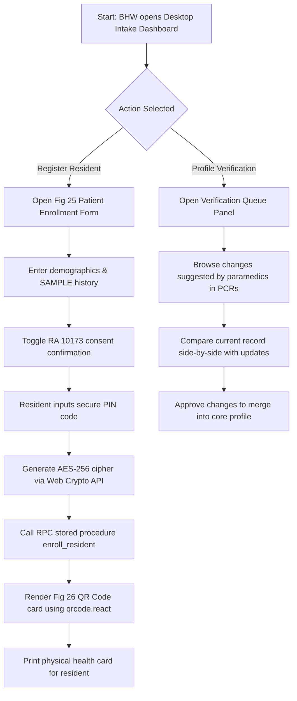
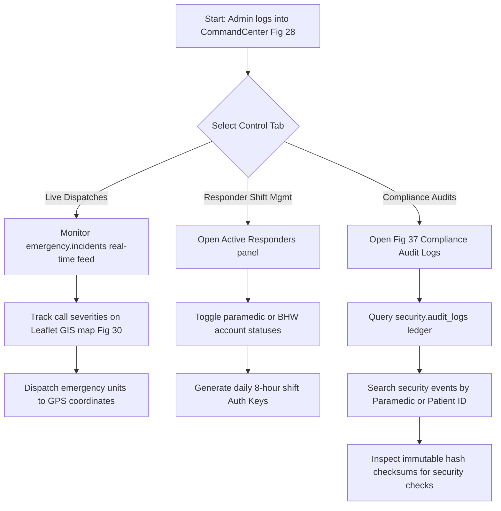

# RespondaCare — Complete System Master Blueprint & Technical Roadmap
**De La Salle–College of Saint Benilde | ISPROJ2 | 3rd Term AY 2025–2026**

> A Progressive Web App (PWA) and Desktop Command Center designed for Barangay 45, Pasay City. RespondaCare solves the core problem of emergency responders "treating blind" by giving authorized personnel instant access to a patient's encrypted emergency medical profile via secure QR code scans.

---

## 🏗️ SYSTEM ARCHITECTURE & SECURE DATA SCHEMAS

RespondaCare operates on an offline-first, client-side encryption model to guarantee absolute compliance with **Republic Act No. 10173 (Data Privacy Act of the Philippines)** and medical informatics standards.



---

## 👥 ROLE-BASED ACCESS CONTROL (RBAC)

| Role | Who They Are | How They Access | Auth Gateway Requirements | Core Responsibilities |
| :--- | :--- | :--- | :--- | :--- |
| **Resident / Patient** | Registered Barangay 45 residents | Mobile PWA / Desktop Web | Credentials + Mandatory RA 10173 Consent Checkbox | Input demographics and medical history, download offline-encrypted QR Card, trigger live GPS SOS panics. |
| **First Responder** | Emergency Response Unit (ERU) Paramedics | Mobile PWA | Credentials + MFA (OTP) + Rotating Shift Auth Key | Scan and decrypt resident QR codes offline, execute ABCDE clinical assessments, log PCR files, export Handover PDFs. |
| **Barangay Health Worker (BHW)** | Barangay health clinic workers | Desktop Web Portal | Role-gated via Supabase RLS policies | Perform resident intakes, generate cryptographic QR Cards, review and verify paramedic profile modification requests. |
| **System Administrator** | Barangay & System Admins | Desktop Command Center | Role-gated credentials + MFA OTP verification | Manage personnel accounts, audit data accesses, analyze incident history, generate rotating shift tokens. |

---

## 🎨 SCREEN-BY-SCREEN DESIGN & WIREFRAME MAPPING
*Mappings connecting Web Wireframes (Figures 1–17) and Mobile Wireframes (Figures 17–39) directly to active project screens.*

### SECTION A: DESKTOP WEB INTERFACE WIREFRAMES (Figures 1–17)

#### Fig 1(Web) — Login Gateway
*   **Wireframe Role:** Shared entry gateway for Barangay Web systems.
*   **Stitch Target:** `RespondaCare_Login` (id: `36f3ff10-091a-c51-bfcd-c17a249e95f5`)
*   **Visual Inputs & Controls:** Split role selection cards: "Resident Portal Access" and "Official & Command Login".
*   **Features:** Directs users to their specific authentication flows, maintaining separation between patient interfaces and clinic staff.
*   **Backend Tables:** None (Static routing gateway).

#### Fig 2(Web) — User Login
*   **Wireframe Role:** Gateway for Admins and BHWs.
*   **Stitch Target:** `RespondaCare_Login` credentials container.
*   **Visual Inputs & Controls:** Email, password inputs, secure "Log In" button, and password reset trigger.
*   **Features:** Role identification routing. BHW redirects to BHW Dashboard; Admin redirects to CommandCenter.
*   **Backend Tables:** Checks authentication credentials against `security.users`.

#### Fig 3(Web) — Create Account (Resident)
*   **Wireframe Role:** Web registration for residents wishing to sign up via desktop.
*   **Stitch Target:** `RespondaCare_Create account for patient` (Desktop view wrapper).
*   **Visual Inputs & Controls:** Name, Email, Password, Birthdate, Barangay validation checkbox, and **Mandatory DPA Consent Switch**.
*   **Features:** Validates consent on-screen before permitting write actions.
*   **Backend Tables:** Creates standard record in `security.users` and `core.residents`.

#### Fig 4(Web) — Create Account (First Responder)
*   **Wireframe Role:** Registration for paramedic personnel.
*   **Stitch Target:** `RespondaCare_first responder create account` (Desktop view wrapper).
*   **Visual Inputs & Controls:** Full name, license credentials, unit designation, password inputs.
*   **Features:** Places user account in `pending_approval` state until reviewed by Admin.
*   **Backend Tables:** Creates inactive record in `security.users` with role indicator `role_id = 2`.

#### Fig 5(Web) — Patient Portal
*   **Wireframe Role:** Patient profile oversight screen on desktop.
*   **Stitch Target:** `RespondaCare_Patient Portal Dashboard` (Desktop layout).
*   **Visual Inputs & Controls:** Medical summaries, emergency contacts list, "Print Encrypted QR Card" selector.
*   **Features:** Provides direct print layout optimized for physical health card production.
*   **Backend Tables:** Reads demographic fields from `core.residents` and displays the encryption state of `health.profiles`.

#### Fig 6(Web) — Digital Enrollment
*   **Wireframe Role:** BHW on-site registration form.
*   **Stitch Target:** `RespondaCare_Resident Health Enrollment` (id: `8c8ac0d6-b4cf-4505-a866-0d03becc450b`).
*   **Visual Inputs & Controls:** Complete multi-pane intake sheet capturing Demographics, Emergency Contacts, and full SAMPLE parameters.
*   **Features:** Encrypts clinical values on the client side using Web Crypto API before writing to database.
*   **Backend Tables:** Invokes `enroll_resident` RPC to write to `security.users`, `core.residents`, and `health.profiles` atomically.

#### Fig 7(Web) — Health Education Library
*   **Wireframe Role:** Desktop view of first-aid resources.
*   **Stitch Target:** `RespondaCare_Health Educ` (Desktop layout).
*   **Visual Inputs & Controls:** Categorized grids of first-aid guidelines, search interface, article list.
*   **Features:** Quick search index of medical emergencies.
*   **Backend Tables:** Queries `core.educational_materials`.

#### Fig 8(Web) — Emergency Report
*   **Wireframe Role:** Web-based emergency incident trigger.
*   **Stitch Target:** Desktop resident portal SOS reporting layout.
*   **Visual Inputs & Controls:** Interactive category selectors (Medical, Trauma, Obstetric), text input for details, and geolocator confirmation check.
*   **Features:** Maps target location via browser API to trigger visual incident updates.
*   **Backend Tables:** Inserts records directly to `emergency.incidents`.

#### Fig 9(Web) — First Responder Dashboard
*   **Wireframe Role:** Unified incident management queue.
*   **Stitch Target:** `RespondaCare_DASHBOARD` (id: `c13b5b30-efaa-42e4-a4ad-377b8de74740`).
*   **Visual Inputs & Controls:** Active incidents sidebar, dispatcher severity markers (Level 1–5 triage badges), responding vehicle assignments.
*   **Features:** Live incident sorting by severity level.
*   **Backend Tables:** Subscribes to real-time additions to `emergency.incidents`.

#### Fig 10(Web) — Residents Directory
*   **Wireframe Role:** Barangay-wide directory of residents.
*   **Stitch Target:** BHW/Admin search dashboard.
*   **Visual Inputs & Controls:** Name queries, age brackets, street filters, checkmark indicators showing if a resident has completed their encrypted profile.
*   **Features:** Searchable, paginated record list.
*   **Backend Tables:** Queries `core.residents` and displays profile indicators from `health.profiles`.

#### Fig 11(Web) — Add Resident Page
*   **Wireframe Role:** BHW quick onboarding portal.
*   **Stitch Target:** BHW intake sheet.
*   **Visual Inputs & Controls:** Full Name, DOB, Barangay validation, contact details.
*   **Features:** Quick demographic onboarding bypass.
*   **Backend Tables:** Writes basic resident stubs directly into `core.residents`.

#### Fig 12(Web) — Map for First Responders
*   **Wireframe Role:** Active emergency GIS telemetry view.
*   **Stitch Target:** `RespondaCare_Map` (id: `baf6e183-df99-46d3-9fc8-16e818a04566`).
*   **Visual Inputs & Controls:** Dynamic GIS map overlay tracking dispatched vehicles and active incidents.
*   **Features:** Interactive pins showing incident locations and levels.
*   **Backend Tables:** Subscribes to GPS telemetry tracks from `emergency.incidents`.

#### Fig 13(Web) — Health Records
*   **Wireframe Role:** Decrypted historical clinical profiles.
*   **Stitch Target:** `RespondaCare_Health Records` (id: `654cffca-40b8-4828-8655-aca42ad9b706`).
*   **Visual Inputs & Controls:** Decrypted clinical data panel showing historical vitals, PCR logs, and treatments.
*   **Features:** Secured with Web Crypto AES decryption algorithms.
*   **Backend Tables:** Fetches records from `health.profiles` and historical reports from `emergency.patient_care_reports`.

#### Fig 14(Web) — Reports
*   **Wireframe Role:** Incident audit logs and operations reports.
*   **Stitch Target:** `RespondaCare_Reports` (id: `287a46fb-11c8-4127-83cd-ec709e8f8727`).
*   **Visual Inputs & Controls:** Response time analytics widgets, dispatch count stats, search filters for resolved emergencies.
*   **Features:** Generates clinical operations summaries.
*   **Backend Tables:** Compiles analytical outputs from `emergency.incidents`.

#### Fig 15(Web) — Settings
*   **Wireframe Role:** System parameters panel.
*   **Stitch Target:** `RespondaCare_Settings` (Desktop layout).
*   **Visual Inputs & Controls:** DB backup controllers, daily auth key configuration parameters, barangay limits.
*   **Features:** Security configuration controls for system administrators.
*   **Backend Tables:** Updates configuration parameters in the database.

#### Fig 16(Web) — Hospital Turnover
*   **Wireframe Role:** Transition log sheet.
*   **Stitch Target:** `RespondaCare_Hostpital Turnover Report` (id: `65accf85-d9ea-4141-99b6-27cd87f0a825`).
*   **Visual Inputs & Controls:** Receiving doctor details, transit vital status parameters, signatures block, and DPA check.
*   **Features:** PDF Generation Engine exports handover details using `jsPDF`.
*   **Backend Tables:** Links directly to matching records in `emergency.patient_care_reports`.

#### Fig 17(Web) — Audit Logs
*   **Wireframe Role:** Operations compliance log list.
*   **Stitch Target:** `RespondaCare_AuditLog` (id: `4a34bb3b-31b6-4c55-be7a-c0f631e0afab`).
*   **Visual Inputs & Controls:** Search indices (ID queries, action filters), chronological event logs with integrity hash checks.
*   **Features:** Renders records from an immutable system ledger.
*   **Backend Tables:** Queries `security.audit_logs`.

---

### SECTION B: MOBILE PWA WIREFRAMES (Figures 17–39)

#### Fig 17(Mobile) — Login Page
*   **Wireframe Role:** Mobile app entry gateway.
*   **Stitch Target:** `RespondaCare_Login` (id: `36f3ff10-091a-c51-bfcd-c17a249e95f5`).
*   **Visual Inputs & Controls:** Mobile responsive email, password forms, forgot password access.
*   **Features:** Role check checks parameters and directs to specific mobile pathways.
*   **Backend Tables:** Authenticates user matches in `security.users`.

#### Fig 18(Mobile) — Patient Sign Up
*   **Wireframe Role:** Mobile resident enrollment portal.
*   **Stitch Target:** `RespondaCare_Create account for patient` (id: `20f85c5e-5e17-425a-8584-e25b49f7a0b6`).
*   **Visual Inputs & Controls:** Demographics inputs (Name, Email, password) + RA 10173 Consent Checkbox.
*   **Features:** Prevents form submission until the Data Privacy agreement check is toggled active.
*   **Backend Tables:** Writes basic stubs to `security.users` and `core.residents`.

#### Fig 19(Mobile) — First Responder Sign Up
*   **Wireframe Role:** Paramedic credentials registration.
*   **Stitch Target:** `RespondaCare_first responder create account` (id: `d74771fc-84b8-4edc-b8f0-06c69c3efd97`).
*   **Visual Inputs & Controls:** EMT license number, full name, email, credentials upload slot.
*   **Features:** Sets paramedic status to `inactive` until verified by system admin.
*   **Backend Tables:** Writes to `security.users` with `is_active = false` and `role_id = 2`.

#### Fig 20(Mobile) — First Responder Login
*   **Wireframe Role:** Two-step authentication flow.
*   **Stitch Target:** `RespondaCare_First Responder Login` (id: `0308b063-b070-4bd3-a87f-9dd68af02273`).
*   **Visual Inputs & Controls:** Two-step login. Initial screen captures password, second screen renders **MFA OTP blocks** (0-9).
*   **Features:** Advanced key action handlers automatically transition input focus upon entry.
*   **Backend Tables:** Checks sessions against Supabase MFA database hooks.

#### Fig 21(Mobile) — Resident Dashboard
*   **Wireframe Role:** Resident portal main hub.
*   **Stitch Target:** `RespondaCare_Patient Portal Dashboard` (id: `9ecb2857-a3b1-4693-ad8e-6934e7b23f23`).
*   **Visual Inputs & Controls:** High-visibility "View QR Card" layout button, geolocated SOS panic button, alerts tray, education access links.
*   **Features:** Simple layout design optimized for speed and visibility.
*   **Backend Tables:** Renders demographic info from `core.residents`.

#### Fig 22(Mobile) — Emergency Report (SOS Button)
*   **Wireframe Role:** Geolocated urgent panic trigger.
*   **Stitch Target:** `RespondaCare_Emergency Reporting` (id: `6bfccba0-82ce-4318-a25c-25ee92e3e3da`).
*   **Visual Inputs & Controls:** Dynamic geolocating map, category cards (Trauma, Medical, Police, Fire), and a **tactile 3-second hold SOS trigger**.
*   **Features:** Holding button for 3 seconds calls navigator API, fetches GPS coordinates, and triggers dispatch.
*   **Backend Tables:** Creates priority emergency record in `emergency.incidents`.

#### Fig 23(Mobile) — Health Education Library
*   **Wireframe Role:** Responsive learning index.
*   **Stitch Target:** Mobile `EducationPage.jsx`.
*   **Visual Inputs & Controls:** Search field, category tags, step-by-step guides.
*   **Features:** Offline client storage lets users access these pages during local blackouts.
*   **Backend Tables:** Loads index content from `core.educational_materials`.

#### Fig 24(Mobile) — Health Education Article
*   **Wireframe Role:** Detailed markdown reader.
*   **Stitch Target:** Mobile article view.
*   **Visual Inputs & Controls:** Title, category tags, clear body markdown text, back button.
*   **Features:** Simple markdown styling.
*   **Backend Tables:** Queries active guide ID from `core.educational_materials`.

#### Fig 25(Mobile) — Patient Enrollment
*   **Wireframe Role:** BHW tablet-optimized intake form.
*   **Stitch Target:** `RespondaCare_Resident Health Enrollment` (id: `8c8ac0d6-b4cf-4505-a866-0d03becc450b`).
*   **Visual Inputs & Controls:** Sequential multi-step forms capturing demographics, emergency contacts, and complete medical histories (Allergies, Meds, History).
*   **Features:** Offline fallback system writes to local cache if network is lost.
*   **Backend Tables:** Synchronizes with database schemas via enrollment APIs.

#### Fig 26(Mobile) — QR Code Generated
*   **Wireframe Role:** Card view of patient's health details.
*   **Stitch Target:** `QR Code & Emergency Contacts` (id: `9473e4a615ee47be9e4069cb8762c7f7`).
*   **Visual Inputs & Controls:** Resident ID details, Emergency contacts list, and a **genuine high-density AES-256 encrypted QR Code**.
*   **Features:** Generates a secure QR image using `qrcode.react` with the payload encrypted on the client side.
*   **Backend Tables:** Uses client-side key inputs to encrypt data.

#### Fig 27(Mobile) — Notifications Hub
*   **Wireframe Role:** Alert and update registry.
*   **Stitch Target:** Mobile notifications center.
*   **Visual Inputs & Controls:** Update notifications list, dispatch alerts, security triggers.
*   **Features:** Real-time visual updates.
*   **Backend Tables:** Reads items from `core.notifications`.

#### Fig 28(Mobile) — First Responders Dispatch Dashboard
*   **Wireframe Role:** Mobile dispatch management screen.
*   **Stitch Target:** Paramedic active dashboard.
*   **Visual Inputs & Controls:** Dynamic list showing current dispatches, active map display with navigation routing, and scanner entry button.
*   **Features:** Active map panel directs responders to geolocated incidents.
*   **Backend Tables:** Queries active dispatches from `emergency.incidents`.

#### Fig 29(Mobile) — Response History
*   **Wireframe Role:** Completed incidents ledger.
*   **Stitch Target:** Responder history logs.
*   **Visual Inputs & Controls:** Calendar logs showing resolved runs, PDF export selectors, filters.
*   **Features:** Renders resolved logs.
*   **Backend Tables:** Loads historical details from `emergency.incidents`.

#### Fig 30(Mobile) — Dispatch Map
*   **Wireframe Role:** GIS street guidance utility.
*   **Stitch Target:** Leaflet navigation screen.
*   **Visual Inputs & Controls:** Full-screen Leaflet street map, zoom actions, direction vectors.
*   **Features:** Computes routes from responder vehicle to active emergency coordinate pins.
*   **Backend Tables:** Visualizes coordinates from `emergency.incidents`.

#### Fig 31(Mobile) — Hospital Handover
*   **Wireframe Role:** Paramedic handover log.
*   **Stitch Target:** Mobile `UnifiedIncidentReport.jsx` disposition panel.
*   **Visual Inputs & Controls:** Input fields for receiving hospital, doctor, sign-off blocks, and "Export Handover PDF" trigger.
*   **Features:** Integrates `jsPDF` library to generate compliant clinical handovers in the field.
*   **Backend Tables:** Writes handovers into `emergency.patient_care_reports`.

#### Fig 32(Mobile) — Patient SAMPLE Profile
*   **Wireframe Role:** Decrypted SAMPLE data overview.
*   **Stitch Target:** `RespondaCare_Health Records` (id: `654cffca-40b8-4828-8655-aca42ad9b706` SAMPLE tab).
*   **Visual Inputs & Controls:** Visual panels organizing active symptoms, high-glow red allergies tags, medications, medical history, oral intake, and incident events.
*   **Features:** Converts scanned QR ciphers into clear text in under 1 second.
*   **Backend Tables:** Renders values stored in local memory from decoded scanner payloads.

#### Fig 33(Mobile) — Dispatch Feed
*   **Wireframe Role:** Real-time scrolling telemetry updates.
*   **Stitch Target:** CommandCenter event sidebar.
*   **Visual Inputs & Controls:** Running feed of dispatch state changes (e.g. "Unit 1 En Route", "Unit 2 Arrived").
*   **Features:** Renders real-time update alerts.
*   **Backend Tables:** Listens to database event alerts via Supabase Realtime channel.

#### Fig 34(Mobile) — Patient Medical Profile
*   **Wireframe Role:** Decrypted secondary clinical attributes.
*   **Stitch Target:** `Patient Medical Profile` screen.
*   **Visual Inputs & Controls:** Chronic conditions, blood groups (A, B, AB, O + Rh factor), surgical records, immunization tracking.
*   **Features:** Client-side decryption rendering of clinical profiles.
*   **Backend Tables:** Decrypts secondary payload structures from the QR card.

#### Fig 35(Mobile) — Patient Care Report
*   **Wireframe Role:** Clinical field assessment form.
*   **Stitch Target:** `RespondaCare_Health Records` (id: `654cffca-40b8-4828-8655-aca42ad9b706` Assessment tab).
*   **Visual Inputs & Controls:** BP, Pulse, Respiratory Rate, SpO2, Temperature, Blood Glucose, GCS Interactive Matrix, and ABCDE clinical selectors.
*   **Features:** Automatically calculates GCS total scores as checkboxes are checked.
*   **Backend Tables:** Writes clinical metrics directly to `emergency.patient_care_reports` and `emergency.vital_signs`.

#### Fig 36(Mobile) — Success Submission Indicator
*   **Wireframe Role:** Action success notification.
*   **Stitch Target:** Success splash card.
*   **Visual Inputs & Controls:** Checkmark display, text confirmation, "Scan Next Code" and "Export Handover PDF" actions.
*   **Features:** Clean visual confirmation of reports successfully synchronized to the Supabase server.
*   **Backend Tables:** Confirms transaction success from `emergency.patient_care_reports`.

#### Fig 37(Mobile) — Audit Logs
*   **Wireframe Role:** Compliance logs on mobile.
*   **Stitch Target:** Mobile compliance log viewer.
*   **Visual Inputs & Controls:** Chronological security events list, search filters, verification state tags.
*   **Features:** Displays recent compliance logs.
*   **Backend Tables:** Reads items from `security.audit_logs`.

#### Fig 38(Mobile) — First Responder Profile
*   **Wireframe Role:** Paramedic account utility.
*   **Stitch Target:** `RespondaCare_Settings` (id: `8a89e5b5-327e-45c7-8465-01421f04b7c6`).
*   **Visual Inputs & Controls:** Personal info card, paramedic ID credentials, assigned rescue vehicle tag, daily shift authorization token status.
*   **Features:** Tracks shift states and displays shift keys in real-time.
*   **Backend Tables:** Renders shift state from `security.users`.

#### Fig 39(Mobile) — ID QR Scanner
*   **Wireframe Role:** Cryptographic QR decoder.
*   **Stitch Target:** `QR Scan & Profile Access` (id: `138aaac1c0064d628d2df27c89fa4b55`).
*   **Visual Inputs & Controls:** Active camera viewfinder, horizontal laser sweep animation, target box brackets, manual input override.
*   **Features:** Parses QR data, extracts ciphertext & salt, and triggers decryption.
*   **Backend Tables:** Logs lookup matches in `security.users`.

---

## 🛠️ CORE FEATURES BUILD & INTEGRATION STATUS

### 1. RESIDENT / PATIENT MODULE

| Feature | Description | Target Screens | Backend Operations | Current Status | What is Missing |
| :--- | :--- | :--- | :--- | :--- | :--- |
| **Digital Enrollment** | Onboard health histories with demographics, SAMPLE logs, and DPA consent flags. | Fig 3, 6 (Web)<br>Fig 18, 25 (Mobile) | Writes demographics to `core.residents` and clinical logs to `health.profiles` | 🔄 **Partial** | Configure Supabase API schemas; write database transaction function to prevent orphaned records. |
| **QR Health ID** | Generate a secure, client-side encrypted health profile card. | Fig 5 (Web)<br>Fig 26 (Mobile) | Generates payload encrypted with AES-256-GCM via client PIN. | 🔄 **Partial** | Real Web Crypto integration; replace mock SVG with active `qrcode.react` generator. |
| **Emergency SOS Panic** | Broadcast priority emergencies with GPS coordinates. | Fig 8 (Web)<br>Fig 22 (Mobile) | Inserts severity level 5 emergency record in `emergency.incidents`. | ❌ **Not Started** | Create `SosPage.jsx` and geolocator telemetry handler. |
| **Health Notifications** | Receive targeted dispatch alerts and clinic messages. | Fig 27 (Mobile) | Queries notifications from `core.notifications`. | ❌ **Not Started** | Integrate Twilio gateway API and push notification queues. |
| **First Aid Hub** | Offline-cached directory of first-aid guides. | Fig 7 (Web)<br>Fig 23, 24 (Mobile) | Queries database entries from `core.educational_materials`. | ❌ **Not Started** | Build `EducationPage.jsx` and populate materials table. |

### 2. FIRST RESPONDER MODULE

| Feature | Description | Target Screens | Backend Operations | Current Status | What is Missing |
| :--- | :--- | :--- | :--- | :--- | :--- |
| **MFA Authentication** | Paramedic authentication with shift authorization keys. | Fig 4 (Web)<br>Fig 20, 38 (Mobile) | Verifies credentials via MFA and tracks token expirations in `security.auth_keys`. | 🔄 **Partial** | Replace sandbox bypass parameters with production Supabase MFA authentication hooks. |
| **Tactical Decryption Scan** | High-speed offline QR scanning and client-side decryption. | Fig 39 (Mobile) | Matches scanned user IDs with keys in memory. | 🔄 **Partial** | Replace mock inputs with actual physical camera decode and API lookup. |
| **SAMPLE / Medical Viewer** | View decrypted clinical files with highlighted allergy alerts. | Fig 13 (Web)<br>Fig 32, 34 (Mobile) | Renders decrypted clinical profiles in memory. | ✅ **Done** | Core views complete. Needs link to real QR scanning outputs. |
| **PCR Assessment** | Record on-scene clinical assessments and vital signs. | Fig 35 (Mobile) | Writes metrics to `emergency.patient_care_reports` and `vital_signs`. | ✅ **Done** | Form inputs and calculation formulas complete. |
| **Hospital Handover PDF** | Export signed clinical handovers to PDF in the field. | Fig 16 (Web)<br>Fig 31, 36 (Mobile) | Compiles transfer details into secure PDF. | 🔄 **Partial** | Integrate `jsPDF` and print formatting templates. |
| **GIS Telemetry Mapping** | Live tracking of dispatched units and incident coordinate pins. | Fig 12 (Web)<br>Fig 30 (Mobile) | Renders geolocation routes dynamically. | ❌ **Not Started** | Integrate Leaflet maps tool and live coordinator hooks. |
| **Active Dispatch Feed** | Real-time scroll feed of incident severity alerts. | Fig 9 (Web)<br>Fig 28, 33 (Mobile) | Realtime tracking of resolved and en route dispatches. | ❌ **Not Started** | Replace local mocks with active Supabase real-time triggers. |

### 3. BARANGAY HEALTH WORKER (BHW) MODULE

| Feature | Description | Target Screens | Backend Operations | Current Status | What is Missing |
| :--- | :--- | :--- | :--- | :--- | :--- |
| **Enrollment Assist** | Direct physical client registration from clinic desk. | Fig 6, 11 (Web)<br>Fig 25 (Mobile) | Coordinates profile intake and triggers encryption. | ✅ **Done** | Client forms complete. Needs atomic backend database transaction integration. |
| **Profile Verification** | Review and merge paramedic profile modification requests. | Fig 10, 13 (Web) | Processes records flagged inside `health.profile_updates`. | ❌ **Not Started** | Build BHW Verification Queue portal and approval triggers. |

### 4. SYSTEM ADMINISTRATOR MODULE

| Feature | Description | Target Screens | Backend Operations | Current Status | What is Missing |
| :--- | :--- | :--- | :--- | :--- | :--- |
| **Active Dispatch Queue** | Unified incident control feed sorted by emergency level. | Fig 9, 12 (Web) | Renders incidents by priority level. | ✅ **Done** | CommandCenter interface, dispatch indicators complete. |
| **User Account Management** | Onboard and manage responder and BHW accounts. | Fig 15 (Web) | Adjusts authentication states in `security.users`. | ❌ **Not Started** | Create administrative portal interface and account triggers. |
| **Audit Logs Viewer** | Immutable log tracking decryption and system events. | Fig 17 (Web)<br>Fig 37 (Mobile) | Compiles events from `security.audit_logs`. | ❌ **Not Started** | Connect log interfaces to `security.audit_logs` API queries. |

---

## 🔄 COMPREHENSIVE END-TO-END FLOWS

### FLOW A: THE RESIDENT PWA EXPERIENCE (Onboarding to SOS Dispatch)



### FLOW B: THE FIRST RESPONDER SCENE TRIAGE (Scan to PDF Handover)



### FLOW C: THE BHW DESK INTAKE & VERIFICATION FLOW



### FLOW D: THE ADMIN SECURITY AUDIT & COMMAND CONTROL FLOW



---

## 🧬 POSTGRESQL ATOMIC INTENTION SCRIPT

To secure patient onboardings, BHW registrations must commit in an atomic PostgreSQL transaction using a stored RPC function.

```sql
CREATE OR REPLACE FUNCTION enroll_resident(
    p_email TEXT,
    p_password_hash TEXT,
    p_full_name TEXT,
    p_barangay TEXT,
    p_consent_given BOOLEAN,
    p_encrypted_payload TEXT
) RETURNS VOID AS $$
DECLARE
    new_user_id UUID;
BEGIN
    -- 1. Insert credentials into security schema
    INSERT INTO security.users (email, password_hash, role_id, is_active)
    VALUES (p_email, p_password_hash, 3, TRUE)
    RETURNING id INTO new_user_id;

    -- 2. Insert core demographic record
    INSERT INTO core.residents (id, full_name, barangay, consent_given, consent_timestamp)
    VALUES (new_user_id, p_full_name, p_barangay, p_consent_given, NOW());

    -- 3. Insert encrypted clinical profile
    INSERT INTO health.profiles (resident_id, encrypted_data, updated_at)
    VALUES (new_user_id, p_encrypted_payload, NOW());
END;
$$ LANGUAGE plpgsql SECURITY DEFINER;
```

---

## 📊 OVERALL PROGRESS SUMMARY

### BY USER ROLE

| User Role | Total Features | ✅ Complete | 🔄 Partial | ❌ Not Started |
| :--- | :---: | :---: | :---: | :---: |
| **Resident / Patient** | 5 | 0 | 2 | 3 |
| **First Responder** | 7 | 2 | 3 | 2 |
| **BHW** | 2 | 1 | 0 | 1 |
| **System Admin** | 3 | 1 | 0 | 2 |
| **TOTAL** | **17** | **4** | **5** | **8** |

### BY WIREFRAME STATUS (40 total)

| Done (11) | Partial (5) | Not Started (24) |
| :--- | :--- | :--- |
| **Web Fig:** 2, 6, 9, 13, 16<br>**Mobile Fig:** 17, 20, 25, 32, 34, 35, 36, 39 | **Web Fig:** 1, 3, 4, 5, 14<br>**Mobile Fig:** 26, 31 | **Web Fig:** 7, 8, 10, 11, 12, 15, 17<br>**Mobile Fig:** 18, 19, 21, 22, 23, 24, 27, 28, 29, 30, 33, 37, 38 |

---

## ⚠️ 3 CRITICAL BLOCKING ARCHITECTURAL DECISIONS

Before proceeding with final implementations, the development team must address these structural questions:

### Decision 1 — Transaction Integrity Safety
> Currently, enrollment writes sequentially to `security.users` $\rightarrow$ `core.residents` $\rightarrow$ `health.profiles`. Any intermediate network loss creates orphaned data rows.
>
> **Action:** Deploy the custom PostgreSQL RPC database function `enroll_resident()` to guarantee all-or-nothing transactions.

### Decision 2 — Off-Line Decryption Protocol
> To ensure physical field decryption without reliable data connectivity, paramedics must decode records completely offline.
>
> **Action:** Encrypt the resident's data on the client side using Web Crypto API. Pack the resulting AES ciphertext and salt directly inside the generated QR card. Paramedics store their shift keys in application memory, decrypting records instantly offline.

### Decision 3 — Handover Format Templates
> The Hospital Handover component exists but only triggers a mock indicator.
>
> **Action:** Integrate `jsPDF` using a highly legible clinic layout stamped with a Data Privacy Act compliance mark to enable immediate exports of patient handovers in the field.

---

## 🗓️ MILESTONES & CAPSTONE TIMELINES
*   **June 30, 2026:** Final Change Requests submitted and signed.
*   **July 07, 2026:** Full repository upload and final requirements submission.
*   **July 13–25, 2026:** ISPROJ2 Presentation & Panel Defense.
*   **August 2026:** RAD Form processing and post-defense clearances.
